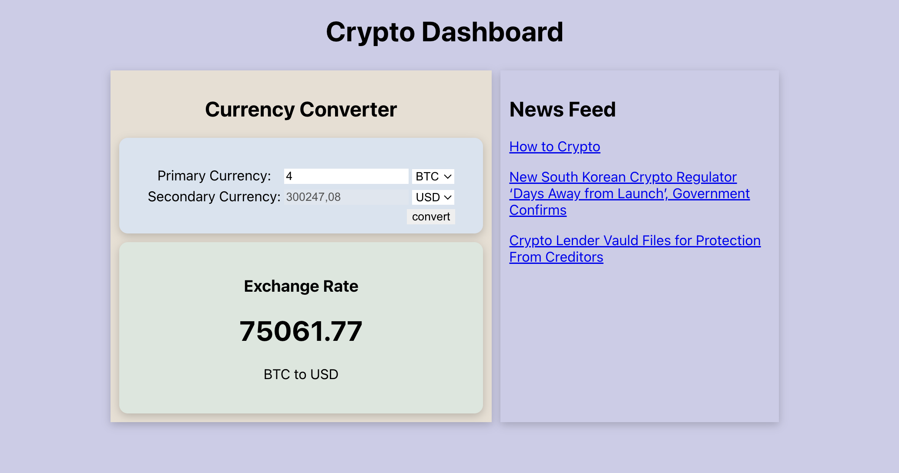

# Crypto Dashboard in React and Nodejs

### Reference tutorial

- [YouTube - API Project! Build a Crypto Dashboard](https://www.youtube.com/watch?v=_itMdiSc0KI) 👉 [Code with Ania Kubów](https://www.youtube.com/@aniakubow) ❤️

Original Repo: [crypto-dashboard-react](https://github.com/kubowania/crypto-dashboard-react)

### Used [Rapid API](https://rapidapi.com/)

- [CURRENCY_EXCHANGE_RATE API](https://rapidapi.com/alphavantage/api/alpha-vantage)
- [Crypto News API](https://rapidapi.com/dbh133/api/crypto-news-live9)

> [!NOTE]
> This software application is not intended for production use and is solely for educational purposes.



## Prerequisite

- `Node.js` is installed ⚡
- Prefered Code-Editor/IDE is installed (For example: `vscode`) ✍
- Terminal is ready 😎 
- Subscribe used Rapid APIs
- Clone [.env.example](./express-api-server/.env.example) to `.env` and add `your_parid_api_key`

## Process

### Install npm packages ⬇

```shell
npm install
```

### Run application 🏎️💨

```shell
npm run watch
```

Open http://localhost:3000 to view it in the browser.

### Clean artifacts 🧹🪣

> [!TIP]
> Keep your things clean!

Remove all `node_modules` and `public` folder.

```shell
npm run clean
```